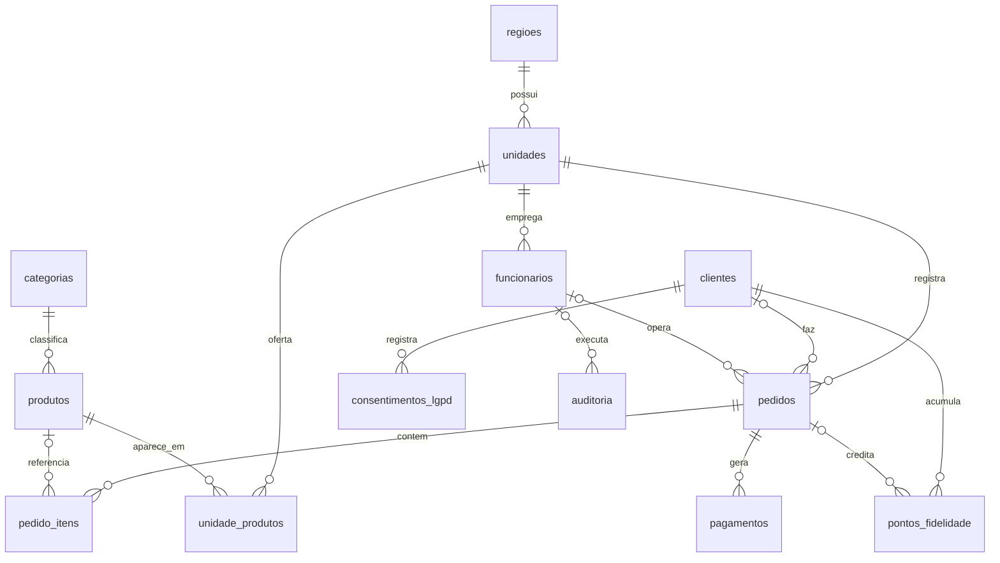

# Modelo de Dados — Rede "Raízes do Nordeste"

Documento de apoio ao DER. SGBD: **MySQL/MariaDB** (XAMPP), engine **InnoDB**,
charset **utf8mb4**. Script completo em [`schema.sql`](schema.sql).

## Diagrama Entidade-Relacionamento (Mermaid)

> Cole o bloco abaixo em https://mermaid.live para gerar a imagem do DER para o PDF.



## Entidades

| Entidade | Papel no negócio |
|---|---|
| **regioes** | Agrupa unidades para consolidação de vendas pela matriz. |
| **unidades** | Franquias; `tipo` distingue cozinha COMPLETA de REDUZIDA. |
| **funcionarios** | Acesso ao sistema com papéis (RBAC). MATRIZ tem `unidade_id` nulo. |
| **clientes** | Participantes do programa de fidelidade (coleta mínima — LGPD). |
| **consentimentos_lgpd** | Trilha versionada e imutável de consentimento por finalidade. |
| **categorias** | Agrupamento do cardápio (Tapiocas, Cuscuz, Bebidas...). |
| **produtos** | Catálogo **global** da franqueadora; `sazonal` marca itens juninos. |
| **unidade_produtos** | Override **local**: preço, disponibilidade e estoque por unidade. |
| **pedidos** | Pedido multicanal (APP/TOTEM/BALCAO/PICKUP) com máquina de status. |
| **pedido_itens** | Itens com **snapshot** de nome/preço (integridade histórica). |
| **pagamentos** | Resultado reportado pelo gateway externo (arquitetura desacoplada). |
| **pontos_fidelidade** | Livro-razão (ledger) de crédito/débito de pontos. |
| **auditoria** | Registro de operações sensíveis (cancelamento, desconto, ajuste). |

## Regras de integridade e decisões

- **Catálogo global × cardápio local**: `produtos` guarda o preço-base padrão da
  franqueadora; `unidade_produtos` permite a cada unidade ajustar `preco_local`
  (NULL = usa o base), ligar/desligar `disponivel` e controlar `estoque`. Resolve
  o requisito "padrão da franquia com variações regionais e sazonais".
- **Snapshots em `pedido_itens`**: nome e preço são copiados na venda, então
  relatórios históricos não mudam se o catálogo for alterado depois.
- **Pedido anônimo**: `pedidos.cliente_id` é opcional (balcão/totem sem cadastro).
- **Pagamento desacoplado**: a aplicação só grava o resultado do gateway; nunca
  trafega dados de cartão. `gateway_ref` é único para evitar processamento duplo.
- **Máquina de status**: `RECEBIDO → EM_PREPARO → PRONTO → ENTREGUE`, com
  `CANCELADO` como ramo de exceção (cancelamento é operação auditada).
- **LGPD**: consentimento versionado + `auditoria` cobrem consentimento explícito,
  rastreabilidade de acessos e prestação de contas.
- **Saldo de pontos**: fonte da verdade é o ledger `pontos_fidelidade`;
  `clientes.pontos_saldo` é um cache para leitura rápida.
```
