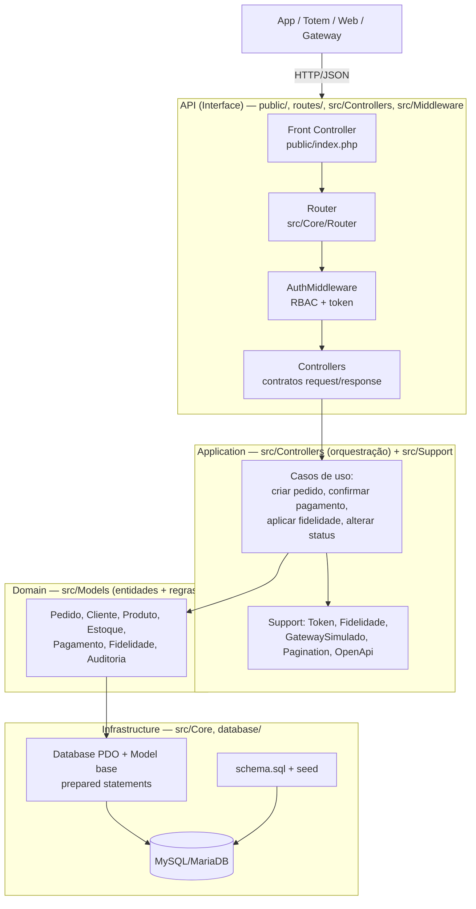

# Arquitetura — Separação em Camadas

A solução adota um padrão **MVC em camadas** com separação clara de responsabilidades. O mapeamento entre as
camadas conceituais (Domain / Application / Infrastructure / API) e as pastas do
projeto é o seguinte:

## Mapeamento camada → pasta

| Camada conceitual | Onde está | Responsabilidade |
|---|---|---|
| **API / Interface** | `public/index.php`, `routes/api.php`, `src/Core/Router`, `src/Middleware`, `src/Controllers` | Rotas, autenticação/autorização, contratos, padrão de resposta/erro, Swagger |
| **Application** | `src/Controllers` (orquestração) + `src/Support` | Casos de uso e serviços: criar pedido, aplicar fidelidade, confirmar pagamento mock, paginação, tokens |
| **Domain** | `src/Models` | Entidades, regras de negócio e validações (máquina de status, baixa de estoque, ledger de pontos) |
| **Infrastructure** | `src/Core/Database`, `src/Core/Model`, `database/` | Persistência (PDO + prepared statements), schema/seed, integração simulada |

## Decisões de organização

- **Front Controller único** (`public/index.php`): ponto de entrada, CORS,
  captura de exceções e tradução para o JSON de erro padronizado.
- **Model base** (`src/Core/Model`) concentra o acesso a dados com *prepared
  statements*, reduzindo repetição e risco de SQL Injection.
- **Controller base** (`src/Core/Controller`) provê `authorize()` (RBAC),
  `unidadeEscopo()` (isolamento por unidade) e `audit()` (rastreabilidade).
- **Support** isola preocupações transversais reutilizáveis (token, fidelidade,
  gateway mock, paginação, OpenAPI), aproximando-se da camada de aplicação.
- A escolha por **PHP puro + PDO** (sem framework) foi deliberada para o escopo
  acadêmico/XAMPP, mantendo a separação de responsabilidades explícita sem
  acoplamento a um framework específico.
