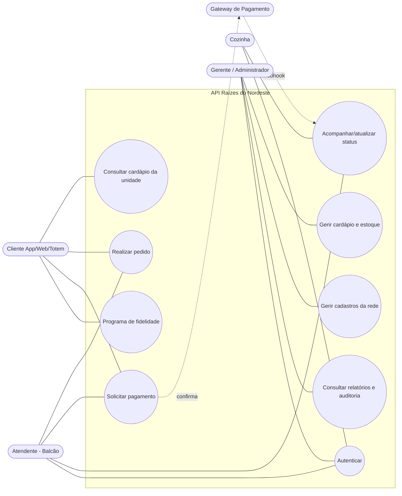
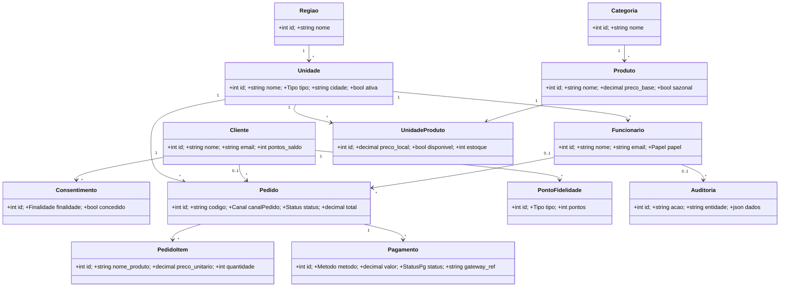

# Diagramas — Rede "Raízes do Nordeste" (Back-end)

Todos os diagramas estão em **Mermaid**: cole cada bloco em https://mermaid.live
para exportar a imagem (PNG/SVG) e anexar ao PDF.

---

## 1. Diagrama de Casos de Uso

Atores: **Cliente** (App/Web/Totem), **Atendente** (Balcão), **Cozinha**,
**Gerente/Administrador**, **Gateway de Pagamento** (sistema externo).



> Observação: `UC2 Realizar pedido` inclui `«include»` a validação de estoque;
> `UC3 Solicitar pagamento` dispara, de forma assíncrona, a atualização de
> status (`UC4`) quando o gateway confirma via webhook.

---

## 2. Descrição de Feature (fluxo crítico): Realizar Pedido + Solicitar Pagamento

**Atores:** Cliente/Atendente (criação), Gateway de Pagamento (confirmação),
Cozinha (preparo).

**Pré-condições:**
- Funcionário autenticado (token válido) com papel autorizado.
- Unidade ativa; itens existentes no cardápio da unidade, disponíveis e com estoque.

**Fluxo principal:**
1. Cliente/Atendente envia `POST /api/pedidos` com `canalPedido`, `itens` e, opcionalmente, `cliente_id`.
2. O sistema valida o canal e os itens; abre uma **transação**.
3. Para cada item: confere disponibilidade e faz **baixa de estoque atômica** (`estoque >= quantidade`).
4. Grava **snapshot** de nome/preço por item e calcula `subtotal`, `desconto` (fidelidade) e `total`.
5. Persiste o pedido com status `RECEBIDO` e confirma a transação → responde **201**.
6. `POST /api/pedidos/{id}/pagamentos` solicita a cobrança ao **gateway externo (mock)** → pagamento `PENDENTE` + `gateway_ref`.
7. O gateway notifica `POST /api/pagamentos/webhook` (assinado por HMAC).
8. Em `APROVADO`: pagamento vira `APROVADO`, pedido avança para `EM_PREPARO` e o cliente recebe pontos de fidelidade.
9. Cozinha/Atendente avançam o status: `EM_PREPARO → PRONTO → ENTREGUE`.

**Pós-condições:**
- Pedido persistido com itens, totais e histórico de status.
- Estoque debitado; pontos creditados (se aprovado e cliente identificado).
- Registros de auditoria para criação, pagamento e mudanças de status.

**Exceções e regras de negócio:**
- **Estoque insuficiente** → `409 ESTOQUE_INSUFICIENTE` e **rollback** total.
- **Produto indisponível/unidade inexistente** → `422`/`404`.
- **Canal ausente/ inválido** → `422 VALIDACAO`.
- **Pagamento negado** (`RECUSADO`) → pedido permanece sem avançar; mensagem coerente.
- **Idempotência do webhook**: reenvio da mesma confirmação **não** reprocessa nem duplica pontos (checa o status atual da transação).
- **Não-cumulatividade**: desconto de fidelidade e campanha não se somam (aplica o maior).

---

## 3. Diagrama de Classes (visão de domínio)



---

## 4. Diagrama de Sequência — Pedido → Pagamento → Status

```mermaid
sequenceDiagram
    actor Cliente
    participant API
    participant DB as Banco
    participant Gateway as Gateway (mock)
    actor Cozinha

    Cliente->>API: POST /api/pedidos (itens, canalPedido)
    API->>DB: BEGIN; baixa estoque atômica; snapshot; total
    alt estoque insuficiente
        DB-->>API: falha
        API-->>Cliente: 409 ESTOQUE_INSUFICIENTE (rollback)
    else ok
        DB-->>API: pedido RECEBIDO
        API-->>Cliente: 201 Pedido criado
    end
    Cliente->>API: POST /api/pedidos/{id}/pagamentos (metodo)
    API->>Gateway: solicitar cobrança
    Gateway-->>API: gateway_ref (PENDENTE)
    API-->>Cliente: 201 PENDENTE
    Gateway->>API: POST /api/pagamentos/webhook (HMAC, APROVADO)
    API->>DB: pagamento APROVADO; pedido EM_PREPARO; +pontos
    API-->>Gateway: 200 processado
    Cozinha->>API: PATCH /api/pedidos/{id}/status (PRONTO, ENTREGUE)
    API->>DB: valida máquina de estados; auditoria
    API-->>Cozinha: 200 status atualizado
```
